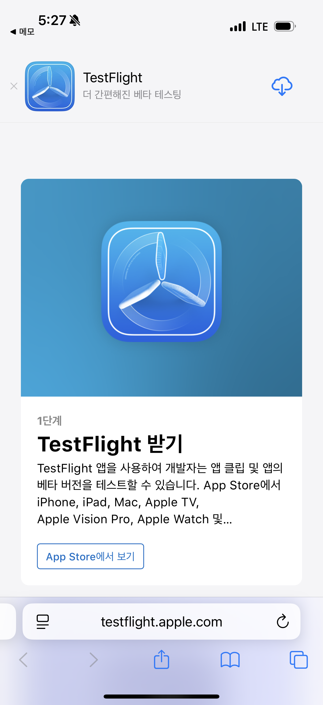
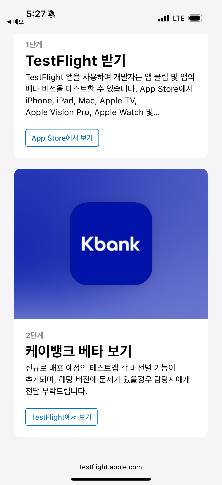

# TestFlight로 오픈베타 앱 다운로드 받는 방법

TestFlight는 iOS 앱의 베타 테스트를 쉽게 할 수 있는 애플 공식 플랫폼입니다. 공개 링크를 통해 누구나 베타 앱을 설치할 수 있습니다.

## 준비 사항
- iPhone 
- Apple ID로 로그인된 기기
- Apple App Store에서 TestFlight 앱 설치 (무료)

## 다운로드 방법

1. **공개 링크 열기**
   - 개발자가 제공한 TestFlight 공개 링크(웹 주소)를 iPhone의 Safari 또는 다른 웹 브라우저에서 엽니다.

2. **TestFlight 설치 유도**
   - 기기에 TestFlight가 설치되어 있지 않으면, 링크를 열 때 자동으로 App Store의 TestFlight 설치 페이지로 이동합니다.
   - App Store에서 "TestFlight" 앱을 설치합니다.

    

3. **앱 설치 시작**
   - TestFlight 앱 설치가 완료되면, 다시 공개 링크로 돌아오거나 TestFlight에서 베타 앱 정보가 자동으로 표시됩니다.
   - "Install" 버튼을 눌러 베타 앱을 설치합니다.

4. **앱 사용 및 업데이트**
   - 설치된 베타 앱을 일반 앱처럼 사용할 수 있습니다.
   - 새로운 빌드가 나오면 TestFlight 앱에서 업데이트 알림을 받게 됩니다.

## 참고사항
- 한 명당 최대 30대 기기에서 설치 및 테스트가 가능합니다.
- 테스트 기간 및 빌드 유효 기간이 제한될 수 있습니다.
- iOS 버전이 베타 앱 요구사항을 충족하는지 확인하세요.
